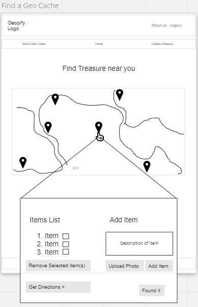

# CachExplorer - Frontend

## Team Members:
- Eddie Ponce
- Isaiah Burkes
- Osborn DelAngel
- Edris Berg
- Taylor White

## Problem Domain

Due to the pandemic, many of us got used to being confined to our homes for good and for bad. However, as things slowly go back to "normal", we wanted to encourage individuals to reconnect with the outdoors once again to promote excercise, social activity, environmental awareness, and a fun escape from work and other daily duties. We hoped to accomplish this by creating a scavenger hunt web application that allows users to find geo-caches and add geo-caches around their surrounding areas or anywhere in the world!

## Backend Repository
- [Go to Repo](https://github.com/dudes-of-color/cachexplorer-backend)

## MVP
- Landing Page
- Login Page
- Sign-Up Page
- Add a Cache
- Find a Cache
- Google Maps API Intergration
- About Us Section

## Stretch Goals
- NewsFeed feature that allows users to share caches to their friend network
  * Like, comment, and share feature
- Delete and edit added Caches
- Community Meetup Feature

## Technologies
- **Back End**
  * **Django:** A Python-based free and open-source web framework that follows the model–template–views architectural pattern
  * **PostgreSQL:** An open-source relational database management system emphasizing extensibility and SQL compliance
  * **Flask:** A micro web framework written in Python
- **Front End** 
  * **NextJS:** An open-source web development framework built on top of Node.js enabling React based web applications functionalities such as server-side rendering and generating static websites
  *  **TailwindCSS:** A utility-first, CSS framework for rapidly building custom user interfaces.
- **APIs**
  * **Google Maps:** Used for dyanmic map intergration, allowing user multiple map layers, street views, routes, and places anywhere in the world
  * **AWS S3:** With Amazon S3 on Outposts, you can create S3 buckets on AWS Outposts and easily store and retrieve objects on premises

## Wireframe

- 
- 
- 
- 
- 
- 
- 
- 

## Domain Model

- 

## FlowChart

- 

## Deliverable
***
### What are the key strengths of each person on the team?
- Isaiah - I am the TEAM LEAD
- Taylor - Knowing what needs to be done, tracking tasks, backend, and collaborating
- Eddie - Working with APIs and improving UI/UX, coding in CSS, Django and docker. Thrives in pair programming environments and stays organized.
- Edris - Working with the front-end and AWS. Team work, coming up with creative solutions collaborating with my team and PowerPoint design. 
- Osborn - collaboration and organization.
  
### How can you best utilize these strengths in the execution of your project?
- Isaiah - troubleshooting errors within code, and writing tests to identify coding issues. I can also communicate and tell my other teammates how I feel in a respectful, yet straightforward, manner.
- Eddie - I can assist with building a good wireframe/domain model during the planning phase, help troubleshoot API issues, and implement a good design layout. Can switch between front end code or backend code as needed to help team
- Taylor - I can assist with coming up with and tracking tasks that needs to be done, helping others with issues, and working on the backend.
- Edris - collaborate with team, have good sense of a user friendly UI, PowerPoint design, and help teammates by sharing knowledge. 
- Osborn -  collaborate with the team, communicate and help teammates.
 
### In which professional competencies do you each want to develop greater strength?
- Isaiah - I want to get experience using Django & React together in the same project. I also want to get experience using a 3rd Party API to solve a real world problem.
- Eddie - I want to build better strength in React/Next.js. I understand best practice for UI/UX but have a tough time with functional components, hooks, etc. All of my previous projects involved myself working on the frontend but I would like to change things up and work on the backend for more experience.
- Taylor - Writing proficiency and documentation, React
- Edris - Listening, communication, python, and React.
- Osborn - Craft/tools - I really want to see how others work with Django/react and their process. Also the local to deployed connection. Everyone does it differently and I want to learn if there is a more effective way to go about the process.

### Knowing that every person in your team needs to understand all aspects of the project, how do you plan to approach the day-to-day work?
 Everyday, we will start with a daily standup to make sure everyone is on the same page. Through paired programming, we will be able to divide up tasks and complete tasks more efficiently. If we do end up having problems, we will ask our teammates first to assist us. If an issues continues to persist, we will get help from a TA or Instructor
NOTE: Undoing, Redoing, Replacing, or otherwise steamrolling the project as an individual is considered to be unacceptable. Account for the inevitable divergence of ideas, execution tasks, and assignments of duties here.

## Conflict Plan
***
Your team should agree on a process for handling disagreements, should they arise. It is better to have a plan in place ahead of time so you can all refer back to it when necessary.
What will be your group’s process to resolve conflict, when it arises?
Talk to each other directly and try to resolve the conflict. If we face difficulty in resolving then discuss it with the TA or instructor.
No need to yell when trying to get your point across. Take the time to hear both sides and see if you can get to a mutual agreement. Try a group vote method if needed. If nothing else works, then pull in a Roger. We hope to bring any conflicts to the front and discuss the issues and see if we can try and bring both sides 

### What will your team do if one person is taking over the project and not letting the other members contribute?
Providing feedback is a must. I would say if anyone feels like one person's voice is coming out more than anyone else, to allow for fearless feedback. A lot of companies do a thing called a daily stand up. This is a space for general conversation of what needs to get done and allows people to have a platform to voice concerns.
### How will you approach each other and the challenges of the project knowing that it is impossible for all members to be at the exact same place in understanding and skill level?
We think the importance of stand-ups at the start of each meeting will be a vital part of getting every member of our group to at least be somewhat on the same page. Comprehension of concepts vary amongst us all, so we will ask each other how we are doing in terms of our progress in the project.

### How will you raise concerns to members who are not adequately contributing?
Discuss the matter with the person and help them if they are stuck and also switch driver/navigator roles regularly.

### How and when will you escalate the conflict if your resolution attempts are unsuccessful?
We will come up with a comprehensive plan to bring it up to the TA/ Instructor to have a chat with this member to help with team-dynamic.

## Communication Plan
***
Before beginning to tackle the project, determine how your group will communicate with each other. This is not an individual effort. Make sure everyone feels comfortable with the identified methods of speaking up.

### What hours will you be available to communicate?
Mon - Thu 6:30pm to 9:30pm, Sat 9:00am - 6:00pm and as much as needed if we have more time available. Mainly during class. We understand that because of our work/life schedule, hours of communication might vary.

### What platforms will you use to communicate (ie. Slack, phone …)?
Slack will be the most efficient platform we will be using in terms of communicating with each other.

### How often will you take breaks?
Every couple hours (or whenever needed) we will take a 15 min break. We can also decide as a group if we need to take a longer break. Breaks are flexible.

### What is your plan if you start to fall behind?
Through stand-ups, if one of us falls behind, or feels like we are not understanding the concepts, we will express how we feel during that time. Other team members will also help out with that person's comprehension of difficult and challenging problems.

### How will you communicate after hours and on the weekend?
Slack

### What is your strategy for ensuring everyone’s voice is heard?
We will have morning stand-ups so that we plan our day and listen to any suggestions/concerns. We will create as safe an environment as possible for everyone to feel comfortable and be themselves.

### How will you ensure that you are creating a safe environment where everyone feels comfortable speaking up?
We will have morning stand-ups so that we plan our day and listen to any suggestions/concerns. We will create as safe an environment as possible  for everyone to feel comfortable and be themselves.

## Work Plan
***
Explain your work plan to track whether everyone is contributing equally to all parts of the project, and that each person is working on “meaty” problems. This should prevent “lone wolf” efforts and “siloed” efforts.
NOTE: While researching and experimentation is always encouraged, writing and/or committing code to the project on your own during non-working hours or over the weekend is never acceptable. This puts the entire project at risk. Be explicit in calling out your work hours and the 
distribution of tasks.

### How will you identify tasks, assign tasks, know when they are complete, and manage work in general?
We will use a Trello board, where cards are made of what needs to get done for the day. For example, someone may need to find a deployment application that would need to be done by a certain due date.

### What project management tool will be used?
Trello
For whiteboards, Miro or Invision
Presentation Deck
Make a single copy of the Presentation Deck Template. Share your copy with all team members, so everyone is working from the same file.
Link to the shared doc in your project plan.
Git Process Plan out what your team’s Git workflow looks like for coding tasks.
Describe at least:

### What components of your project will live on GitHub?
All the feature branches will live on GitHub.

### How will you share the repository with your teammates?
We each will have a featured branch in our group project repository. This will be shared with our entire group to see the progress we have each made.
Ex: Main, dev, feature-home, feature-google-api, feature-login

### What is your Git flow?
- Pick a task
developing on the local feature branch. i.e. `<name_initial>-<feature_name>`
When feature developing is done, make PR to remote feature branch
PR reviews
Merge to the dev branch
Once MVP is done, merge dev to main
Celebrate our victory!

### Will you be using a PR review workflow?
Yes

### How many people must review a PR?
Minimum of 2
Who merges PRs?
One of the people that reviewed the PR.
We can post about it in Slack whenever someone wants to merge.

### How often will you merge?
We will merge when a feature is complete after at least 2 members review the pull request that will not interfere with working code.

### How will you communicate that it’s time to merge?
Through slack, or by communicating with our group members in Remo.
